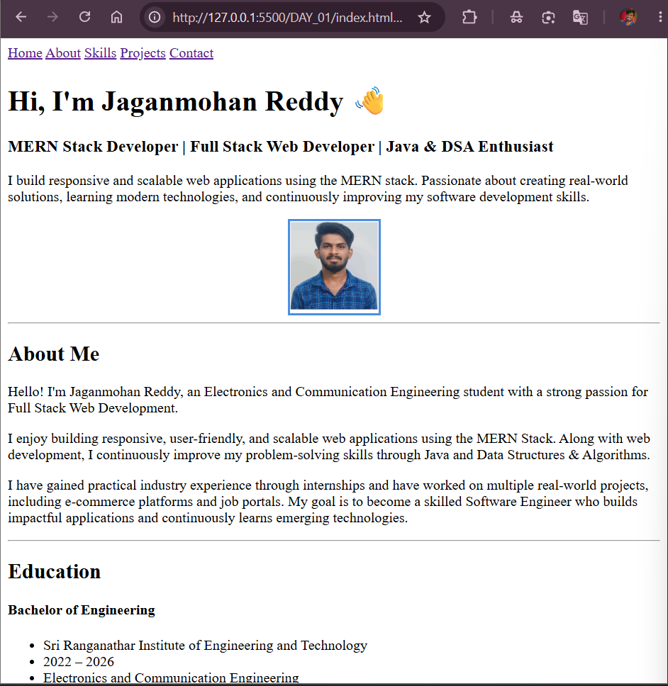

# 🚀 Day 01 - HTML Portfolio Website

## 📌 Overview

Welcome to **Day 01** of my **100 Days Full Stack Developer Journey**.

Today, I revised the fundamentals of **HTML5** by building a complete **Personal Portfolio Website** using only HTML. The primary focus was on writing clean, semantic, and well-structured markup without using any CSS or JavaScript.

---

## 🎯 Objectives

* Practice HTML5 fundamentals
* Learn semantic HTML structure
* Build a personal portfolio webpage
* Improve code readability and organization

---

## 📚 Topics Covered

* HTML Boilerplate
* Semantic HTML
* Navigation
* Headings
* Paragraphs
* Lists
* Images
* Tables
* Hyperlinks
* Contact Links (`mailto:` & `tel:`)
* Sections
* Articles
* Footer

---

## 🛠 Features

* Personal Introduction
* About Me
* Education
* Skills
* Projects
* Internship Experience
* Achievements
* Contact Information
* Navigation Menu
* Profile Photo

---

## 💡 Key Learnings

* Importance of semantic HTML elements
* Creating structured webpages
* Building accessible navigation using anchor links
* Organizing content using sections and articles
* Writing clean and readable HTML code

---

## 🚀 Technologies Used

* HTML5

---

## 📂 Project Structure

```
Day-01/
│
├── index.html
├── profile photo.jpg
├── portfolio.png
└── README.md
```

---

## 📸 Preview

> 

---

## 🎯 Challenge Status

✅ Day 01 Completed

---

## 📅 Next Goal

Day 02 - CSS Fundamentals

* CSS Selectors
* Colors
* Typography
* Box Model
* Portfolio Styling

---

### ⭐ If you like this project, feel free to explore the rest of my Full Stack Developer Journey!
