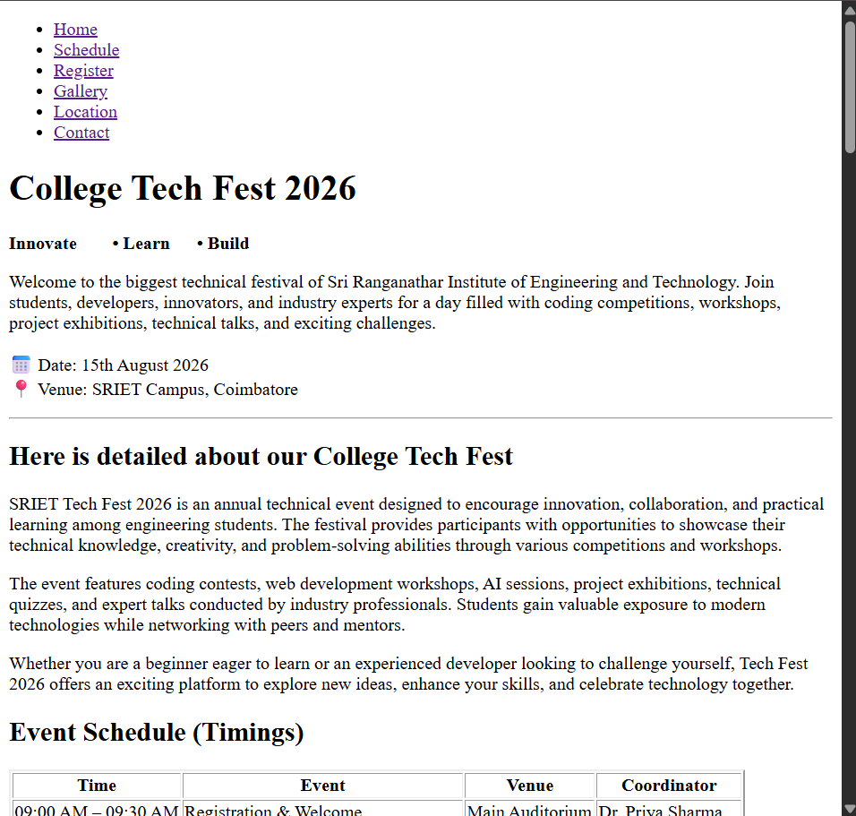
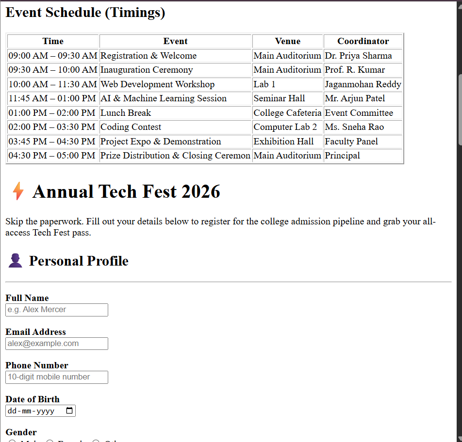
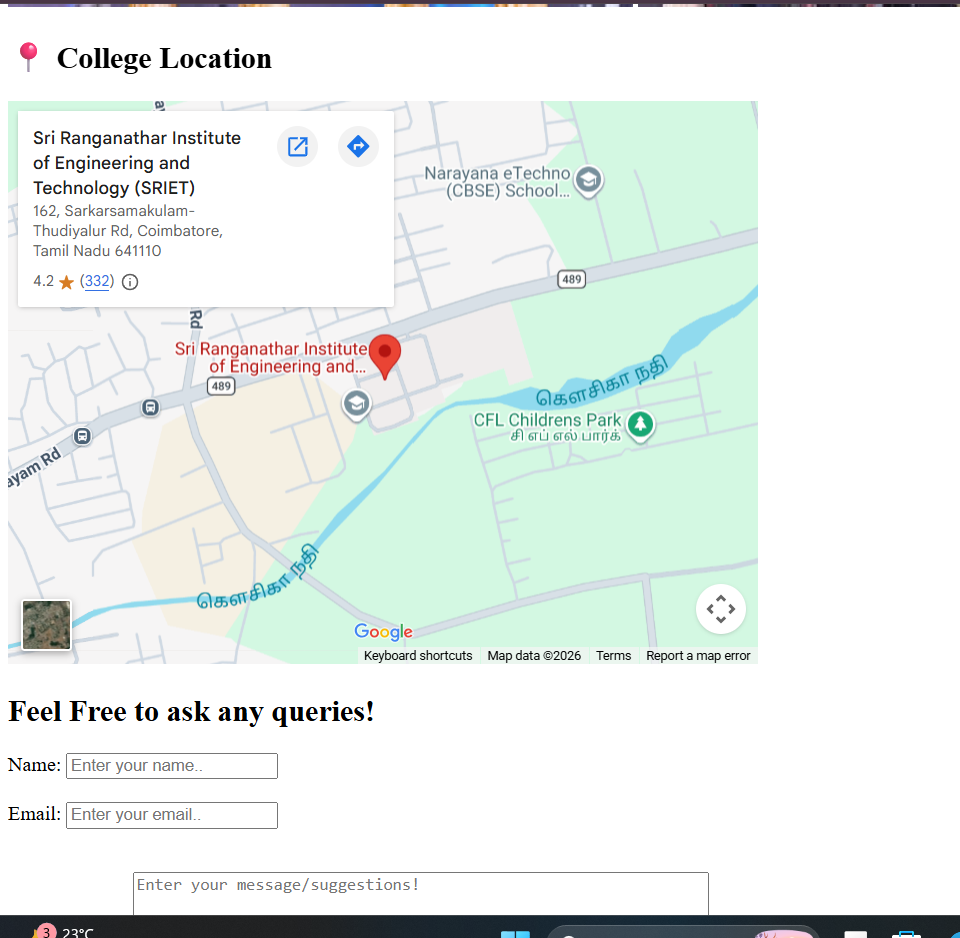

# Day 02 – HTML Intermediate

## 📚 Topics Covered

* HTML Tables
* HTML Forms
* Audio Tag
* Video Tag
* iframe
* Semantic HTML
* Form Validation

## 📂 Assignments

* Student Marksheet Table
* College Registration Form
* Audio & Video Demo
* iframe Demo

## 🚀 Final Project

**College Tech Fest 2026 Website**

### Features

* Semantic HTML Structure
* Navigation Bar
* Event Schedule Table
* Registration Form
* Audio Welcome Message
* Event Promo Video
* YouTube Campus Tour
* Google Maps Location
* Contact Section

# 📸 Project Preview

## Home Page

---

## Registration Form

---

## Location

## 🛠️ Technologies

* HTML5

## 🎯 Learning Outcome

Learned how to build structured web pages using semantic HTML and integrated multimedia, forms, tables, and embedded external content into one complete project.

---

⭐ Part of my **#100DaysFullStackDevChallenge**
