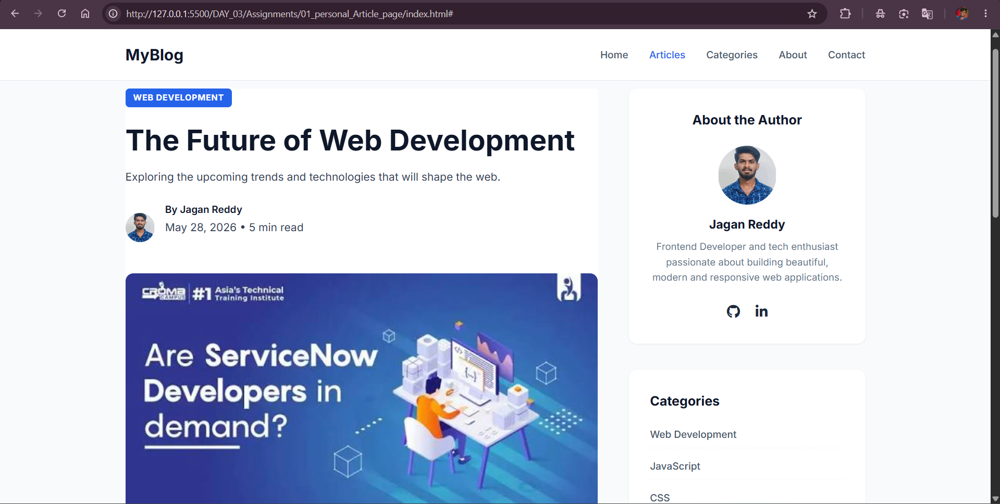
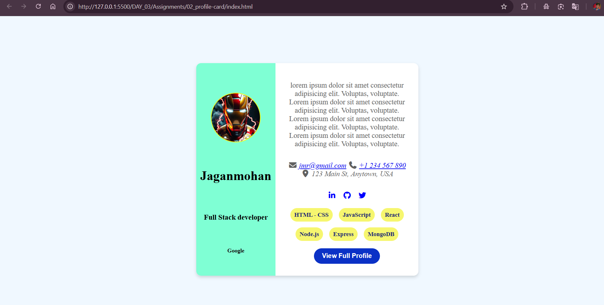

# 📖 CSS Fundamentals Projects

This repository contains my Day 03 projects from the **#100DaysOfFullStackDev** challenge. These projects focus on practicing **HTML5 semantic elements** and **CSS fundamentals**, including layouts, typography, Flexbox, spacing, colors, cards, responsive design, and UI styling.

---

## 🚀 Projects Included

### 1️⃣ Modern Blog Article Page

A responsive blog article layout inspired by modern blogging platforms.

### Features

* Responsive navigation bar
* Featured article section
* Author profile
* Styled quote block
* Sidebar with:

  * About Author
  * Categories
  * Popular Articles
* Newsletter subscription
* Responsive footer
* Mobile-friendly layout

### Technologies

* HTML5
* CSS3
* Flexbox
* CSS Grid
* Google Fonts
* Font Awesome

---

### 2️⃣ Professional Developer Profile Card

A modern developer profile card showcasing personal information and skills.

### Features

* Circular profile image
* Developer information
* Contact details
* Social media icons
* Skills section
* Call-to-action button
* Responsive Flexbox layout

### Technologies

* HTML5
* CSS3
* Flexbox
* Font Awesome

---

## 📂 Project Structure

```
DAY_03/
│
├── Article-Page/
│   ├── index.html
│   ├── style.css
│   └── assets/
│
├── Profile-Card/
│   ├── index.html
│   ├── profile.css
│   └── assets/
│
└── README.md
```

---

## 📸 Project Preview

### 📰 Modern Blog Article



---

### 👤 Profile Card



---

## 🎯 Concepts Practiced

* Semantic HTML
* CSS Selectors
* Box Model
* Typography
* Colors
* Margin & Padding
* Borders & Border Radius
* Flexbox
* CSS Grid
* Positioning
* Hover Effects
* Responsive Design
* Google Fonts
* Font Awesome Icons

---

## 📚 Learning Outcome

Through these projects I learned how to:

* Build professional webpage layouts
* Create reusable UI components
* Structure webpages using semantic HTML
* Style responsive interfaces using Flexbox and Grid
* Design modern cards, sidebars, and navigation bars
* Improve visual hierarchy using spacing and typography

---

⭐ Part of my **100 Days Full Stack Development Challenge**
