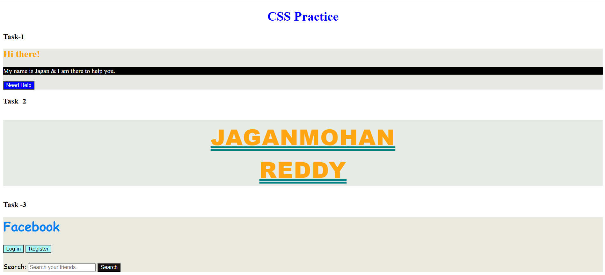
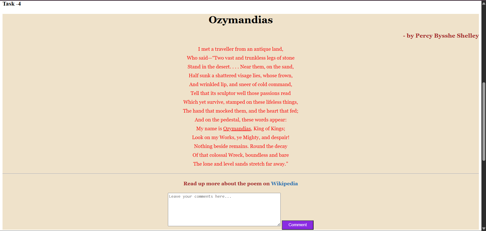
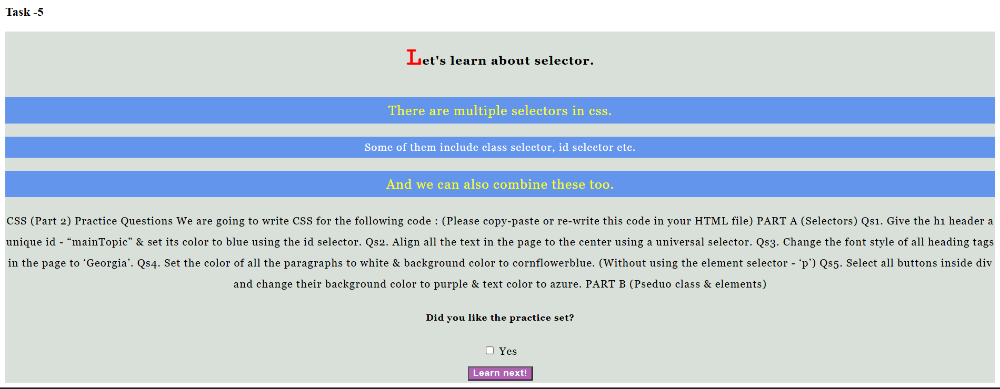

# Day 04 – CSS Fundamentals 🎨

## 📚 Topics Covered

* CSS Syntax
* Colors & Background Colors
* Color Systems
* Font Family
* Font Size
* Font Weight
* Text Align
* Letter Spacing
* Line Height
* Text Decoration
* Text Transform
* CSS Selectors

  * Universal Selector
  * Element Selector
  * Class Selector
  * ID Selector
  * Descendant Selector
  * Child Selector
  * Sibling Selector
  * Attribute Selector
* Pseudo Classes
* Pseudo Elements
* CSS Cascade
* Specificity
* Inheritance
* !important

---

## 💻 Practice Tasks

### ✅ Task 1

Basic CSS Selectors Practice

### ✅ Task 2

Typography & Text Styling

### ✅ Task 3

Facebook Mini UI Styling

### ✅ Task 4

Poem Styling (Ozymandias)

### ✅ Task 5

Selectors & Pseudo Classes Practice

---

## 📸 Preview

---

---

---

## 🚀 Progress

✔ HTML Completed

✔ CSS Fundamentals Completed

➡️ Next: Day 05 – CSS Box Model & Display
