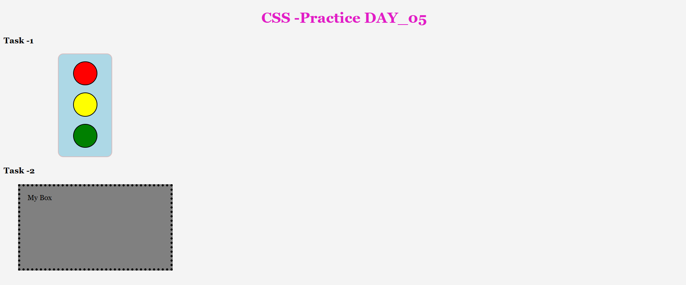
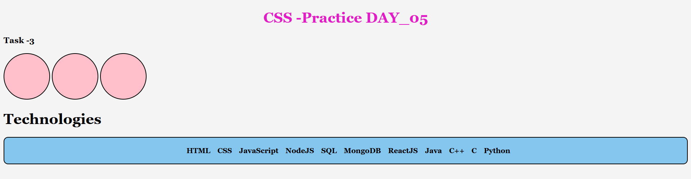
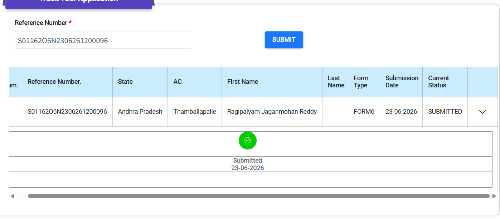

# Day 05 – CSS Box Model & Display 📦

## 📚 Topics Covered

* Width & Height
* Border
* Border Radius
* Margin
* Padding
* Box Sizing
* Display

  * Block
  * Inline
  * Inline-block
* Relative Units

  * em
  * rem

---

## 💻 Practice Tasks

### ✅ Task 1 – Traffic Signal

Practiced:

* Width
* Height
* Border
* Border Radius
* Margin

### ✅ Task 2 – Box Model

Practiced:

* Margin
* Padding
* em
* rem
* Border

### ✅ Task 3 – Display Property

Practiced:

* Inline
* Block
* Inline-block

### ✅ Task 4 – Product Card UI

Built a responsive product card using:

* Box Model
* Display
* Hover Effects
* Icons
* Buttons
* Border Radius
* Box Shadow

---

## 📸 Preview

### Task 1 and 2

### Task 3

### Task 4

---

## 🚀 Progress

✅ HTML Fundamentals

✅ CSS Fundamentals

✅ CSS Box Model

➡️ Next: Position, Overflow, Z-index, Transform & Transition
