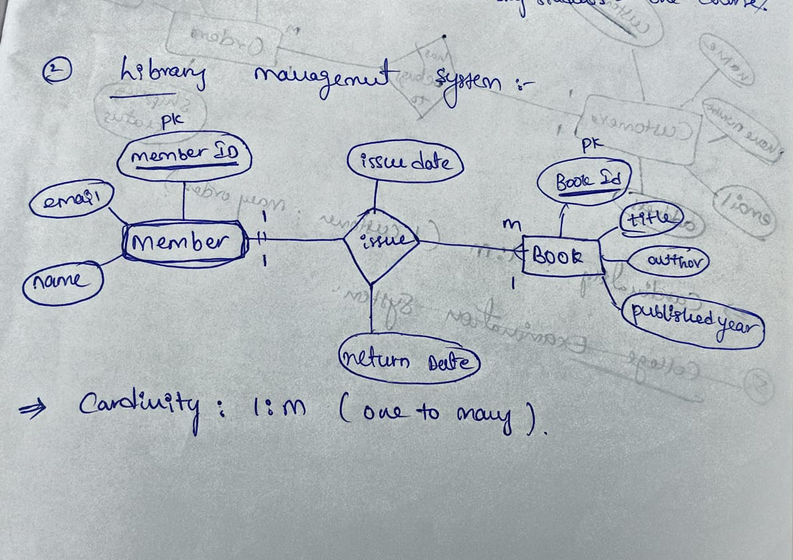
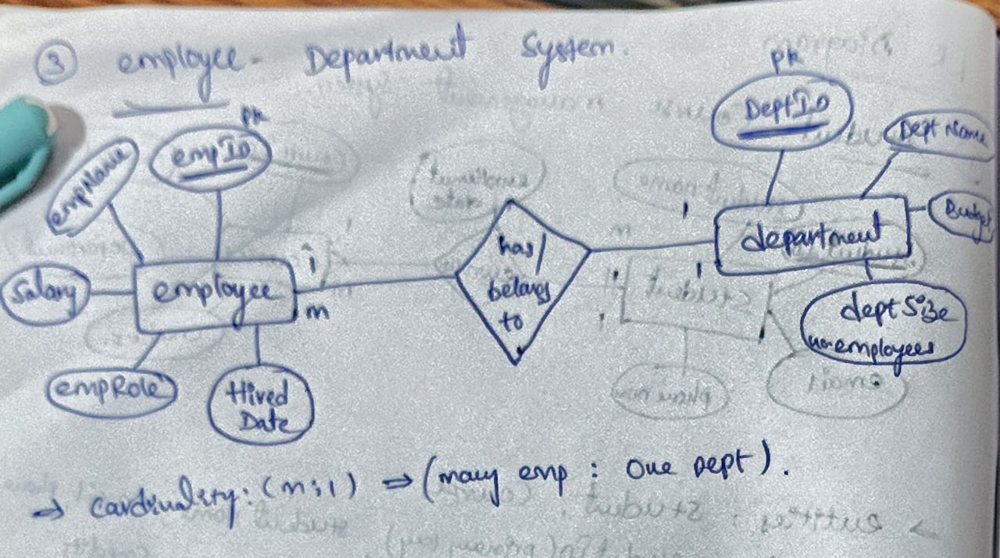
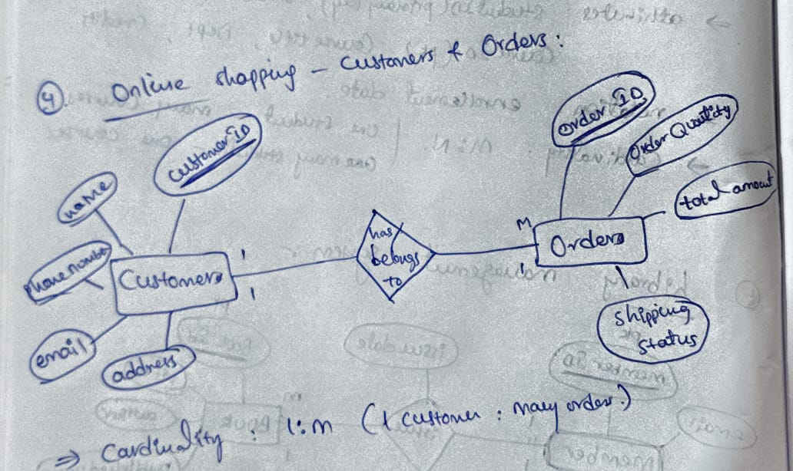
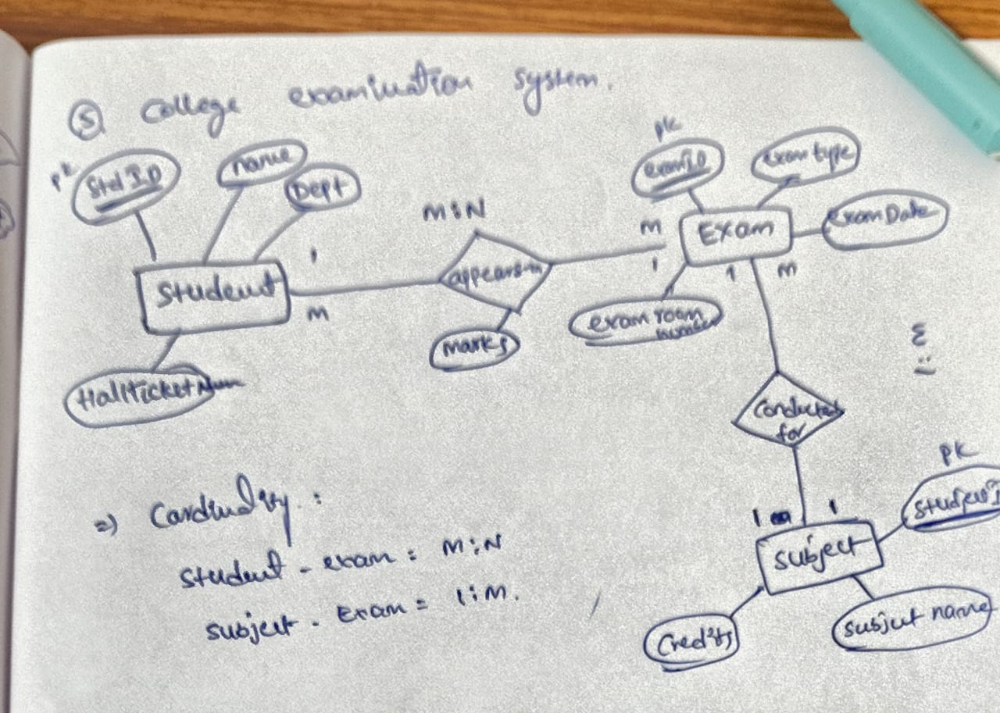
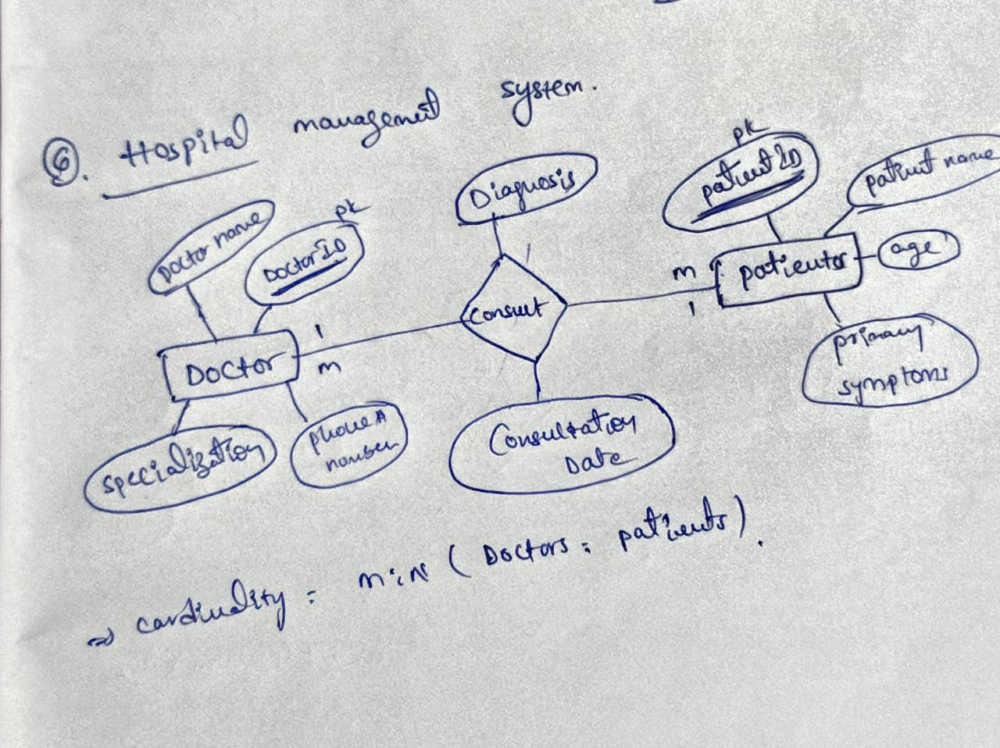

# Database Design and Entity-Relationship (ER) Diagrams

## 1. Student–Course Management System

### Problem Statement
Design an ER diagram for a system where:
* A Student can enroll in multiple Courses
* A Course can have multiple Students
* Store the enrollment date

### System Specifications
* **Entities**: `STUDENT`, `COURSE`
* **Attributes**: 
  * `STUDENT` $\rightarrow$ `StudentID` (PK), `StudentName`, `Email`, `DateOfBirth`

  * `COURSE` $\rightarrow$ `CourseID` (PK), `CourseName`, `Credits`, `Department`
* **Relationship**: `ENROLLMENT`
* **Descriptive Attributes (on Relationship)**: `EnrollmentDate`
* **Cardinality**: Many-to-Many (M:N)

### ER Diagram Layout

---

## 2. Library Management System

### Problem Statement
Design an ER diagram for a library where:
* Books are issued to Members
* A member can issue multiple books
* A book can be issued to only one member at a time
* Include: Issue date, Return date

### System Specifications
* **Entities**: `MEMBER`, `BOOK`
* **Attributes**:
  * `MEMBER` $\rightarrow$ `MemberID` (PK), `MemberName`, `MemberEmail`

  * `BOOK` $\rightarrow$ `BookID` (PK), `BookTitle`, `BookAuthor`, `BookPubYear`
* **Relationship**: `ISSUE`
* **Descriptive Attributes (on Relationship)**: `IssueDate`, `ReturnDate`
* **Cardinality**: One-to-Many (1:M) 

  *(Note: 1 Member can hold multiple books, but 1 Book can only be assigned to 1 Member at any given time).*

### ER Diagram Layout

---

## 3. Employee–Department System

### Problem Statement
Design an ER diagram where:
* Each Employee belongs to one Department
* A department can have multiple employees
* Include attributes such as: Employee role, Salary

### System Specifications
* **Entities**: `EMPLOYEE`, `DEPARTMENT`
* **Attributes**:
  * `EMPLOYEE` $\rightarrow$ `EmpID` (PK), `EmpName`, `Salary`, `EmpRole`, `HireDate`

  * `DEPARTMENT` $\rightarrow$ `DeptID` (PK), `DeptName`, `Location`
* **Relationship**: `BELONGS_TO`
* **Cardinality**: Many-to-One (M:1)

### ER Diagram Layout

---

## 4. Online Shopping – Customer & Orders

### Problem Statement
Design an ER diagram for:
* Customers placing Orders
* A customer can place multiple orders
* Each order belongs to one customer
* Include: Order date, Total amount

### System Specifications
* **Entities**: `CUSTOMER`, `ORDER`
* **Attributes**:
  * `CUSTOMER` $\rightarrow$ `id` (PK), `name`, `email`, `address`, `phone number`

  * `ORDER` $\rightarrow$ `order id` (PK), `orderedDate`, `orderQty`, `total amount`, `shippingStatus`
* **Relationship**: `PLACES`
* **Cardinality**: One-to-Many (1:M)

### ER Diagram Layout

---

## 5. College Examination System

### Problem Statement
Design an ER diagram with the following entities: Students, Subjects, Exams.
* A student can appear for multiple exams
* Each exam is conducted for one subject
* Store marks obtained

### System Specifications
* **Entities**: `STUDENT`, `SUBJECT`, `EXAM`
* **Attributes**:
  * `STUDENT` $\rightarrow$ `StudentID` (PK), `StudentName`, `Dept`, `HallTicket`

  * `SUBJECT` $\rightarrow$ `SubjectCode` (PK), `SubjectID`, `SubjectName`

  * `EXAM` $\rightarrow$ `ExamID` (PK), `ExamType`, `ExamDate`
* **Relationships**:
  * `APPEARS_IN` (Between `STUDENT` and `EXAM`) $\rightarrow$ Cardinality: **M:N**
  * `CONDUCTED_FOR` (Between `EXAM` and `SUBJECT`) $\rightarrow$ Cardinality: **M:1**
* **Descriptive Attributes (on Relationship)**: `Marks` *(attached directly to the APPEARS_IN relationship)*

### ER Diagram Layout

---

## 6. Hospital Management System

### Problem Statement
Design an ER diagram where:
* Doctors treat Patients
* A doctor can treat many patients
* A patient can consult multiple doctors
* Include: Consultation date, Diagnosis

### System Specifications
* **Entities**: `DOCTOR`, `PATIENT`
* **Attributes**:
  * `DOCTOR` $\rightarrow$ `DoctorID` (PK), `DoctorName`, `Specialization`, `Phone`

  * `PATIENT` $\rightarrow$ `PatientID` (PK), `PatientName`, `Age`, `PrimarySymptom`
* **Relationship**: `CONSULT`
* **Descriptive Attributes (on Relationship)**: `ConsultationDate`, `Diagnosis`
* **Cardinality**: Many-to-Many (M:N)

### ER Diagram Layout

