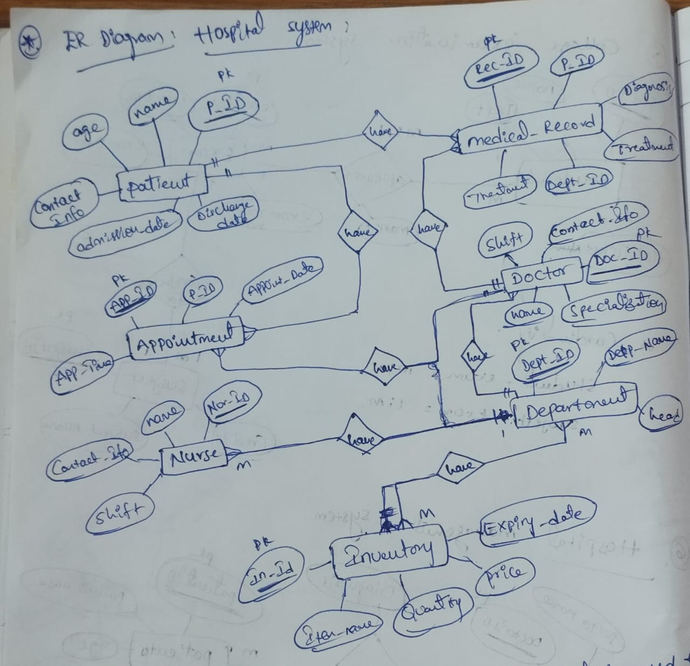
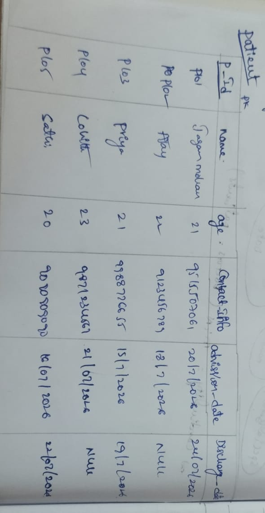
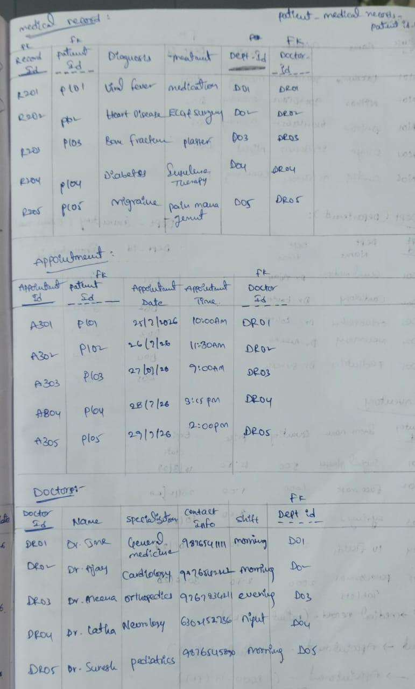
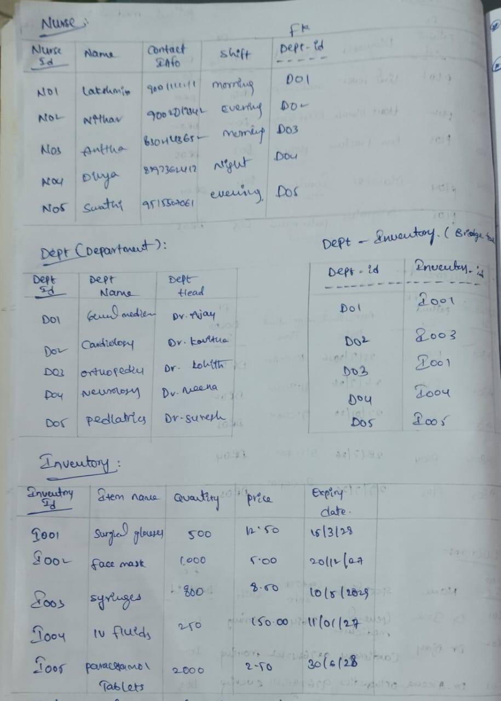
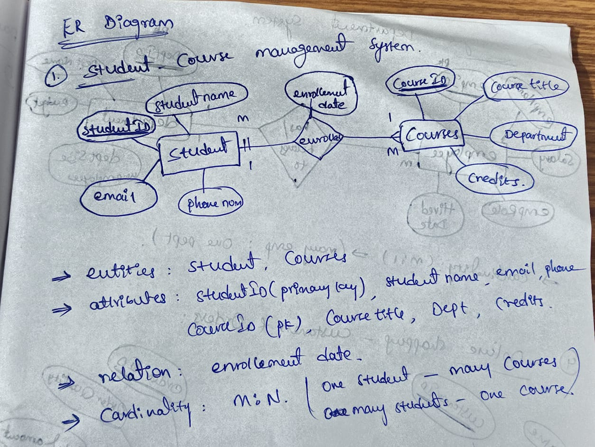
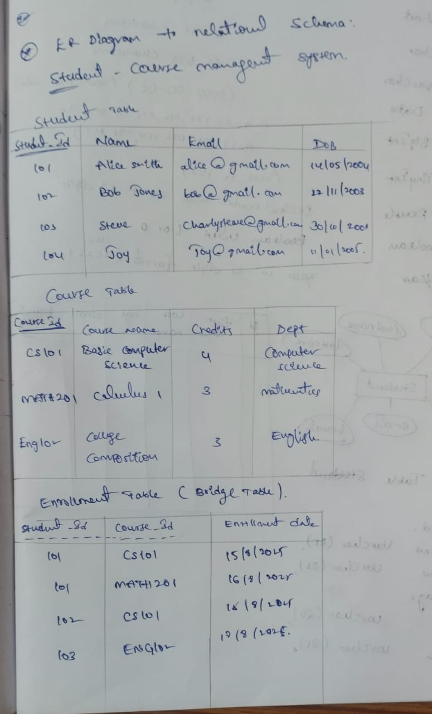

# ER Diagram to Relational Schema

# 1. Hospital Management System

## Problem Statement

Design an ER diagram for a Hospital Management System with the following entities:

- Patient
- Medical Record
- Appointment
- Doctor
- Nurse
- Department
- Inventory

### Patient Attributes

- Patient_ID (PK)
- Name
- Age
- Contact_Info
- Admission_Date
- Discharge_Date

### Medical Record Attributes

- Record_ID (PK)
- Patient_ID
- Diagnosis
- Treatment
- Department_ID

### Appointment Attributes

- Appointment_ID (PK)
- Patient_ID
- Appointment_Date
- Appointment_Time

### Doctor Attributes

- Doctor_ID (PK)
- Name
- Specialization
- Contact_Info
- Shift

### Nurse Attributes

- Nurse_ID (PK)
- Name
- Contact
- Shift

### Department Attributes

- Department_ID (PK)
- Department_Name
- Department_Head

### Inventory Attributes

- Inventory_ID (PK)
- Item_Name
- Quantity
- Price
- Expiry_Date

---

## Relationships

- Patient → Medical Record (1:M)
- Patient → Appointment (1:M)
- Doctor → Appointment (1:M)
- Doctor → Medical Record (1:M)
- Doctor → Department (M:1)
- Department → Nurse (1:M)
- Department → Inventory (M:N)

---

## ER Diagram

---

## Relational Schema

---

# 2. Student–Course Management System

## Problem Statement

Design an ER diagram for a system where:

- A Student can enroll in multiple Courses.
- A Course can have multiple Students.
- Store the Enrollment Date.

---

## System Specifications

### Entities

- STUDENT
- COURSE

### Student Attributes

- StudentID (PK)
- StudentName
- Email
- DateOfBirth

### Course Attributes

- CourseID (PK)
- CourseName
- Credits
- Department

### Relationship

- ENROLLMENT

### Relationship Attribute

- EnrollmentDate

### Cardinality

- Student ↔ Course (M:N)

---

## ER Diagram

---

## Relational Schema

---

# Key Learnings

- Converted ER Diagrams into Relational Schemas.
- Identified Primary Keys and Foreign Keys.
- Understood relationship mapping (1:1, 1:M, M:N).
- Used bridge tables for many-to-many relationships.
- Learned the standard process of database schema design before SQL implementation.

---

**Author:** Ragipalyam Jagan Mohan Reddy  
**Day 27 – SQL Journey**  
**Topic:** ER Diagram to Relational Schema