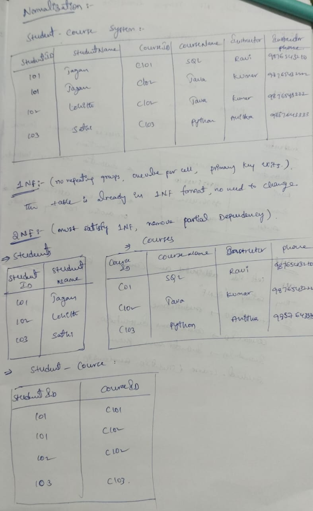
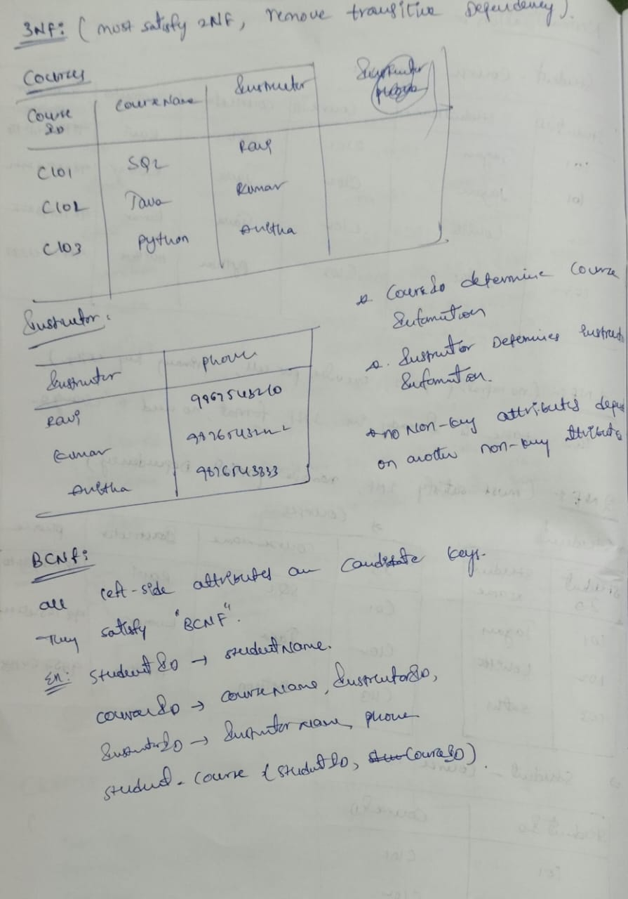
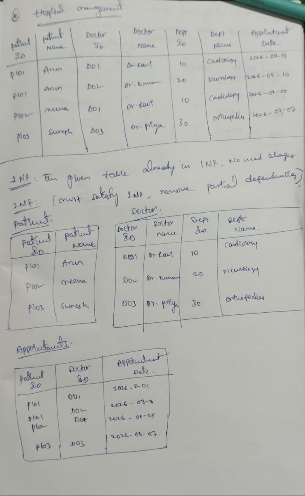
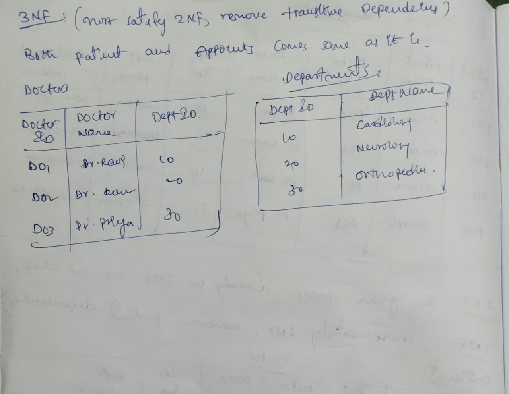

# Database Normalization

## Overview

Database Normalization is the process of organizing data into well-structured tables to eliminate redundancy, improve consistency, and maintain data integrity.

### Objectives

- Eliminate duplicate data
- Reduce data redundancy
- Prevent update, insert, and delete anomalies
- Improve database maintainability
- Ensure efficient storage and relationships

---

# 1. Student–Course Management System

## Problem Statement

Normalize the given Student–Course Management System from **1NF to BCNF** by identifying partial and transitive dependencies and decomposing the tables into a well-structured relational model.

### Initial Table

| StudentID | StudentName | CourseID | CourseName | Instructor | InstructorPhone |
|-----------:|------------|----------:|------------|------------|-----------------|
|101|Jagan|C101|SQL|Ravi|9876543210|
|101|Jagan|C102|Java|Kumar|9876543222|
|102|Lohith|C102|Java|Kumar|9876543222|
|103|Priya|C103|Python|Anitha|9876543333|

### Normalization Process

The table was analyzed and normalized through:

- First Normal Form (1NF)
- Second Normal Form (2NF)
- Third Normal Form (3NF)
- Boyce–Codd Normal Form (BCNF)

### Solution

> **Image Placeholder**

---

# 2. Hospital Management System

## Problem Statement

Normalize the Hospital Management System database from **1NF to BCNF** by identifying dependencies and restructuring the tables into an optimized relational schema.

### Initial Table

| PatientID | PatientName | DoctorID | DoctorName | DepartmentID | DepartmentName | AppointmentDate |
|-----------:|------------|----------:|------------|-------------:|----------------|-----------------|
|P101|Arun|D01|Dr. Ravi|10|Cardiology|2026-08-01|
|P101|Arun|D02|Dr. Kumar|20|Neurology|2026-08-10|
|P102|Meena|D01|Dr. Ravi|10|Cardiology|2026-08-05|
|P103|Suresh|D03|Dr. Priya|30|Orthopedics|2026-08-07|

### Normalization Process

The table was analyzed and normalized through:

- First Normal Form (1NF)
- Second Normal Form (2NF)
- Third Normal Form (3NF)
- Boyce–Codd Normal Form (BCNF)

### Solution

> **Image Placeholder**

---

# Key Concepts Applied

- Primary Key
- Composite Key
- Candidate Key
- Partial Dependency
- Transitive Dependency
- Determinant
- Functional Dependency
- Data Redundancy Elimination
- BCNF Decomposition

---

## Learning Outcome

Through these normalization exercises, I learned how to transform unoptimized relational tables into efficient database schemas by applying normalization principles up to BCNF. This process improves data integrity, reduces redundancy, and supports scalable database design.